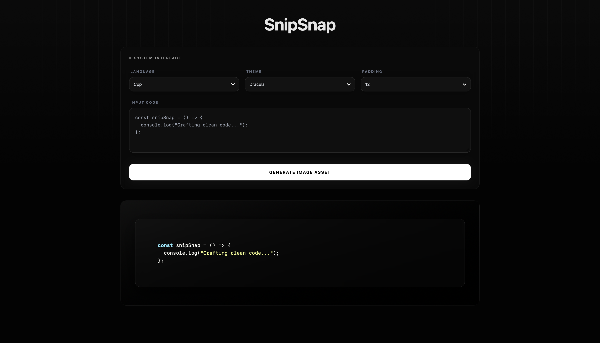

# SnipSnap

> Spatial code beautification for the modern developer.

**SnipSnap** is a high-end, minimalist developer tool designed to transform raw code into professional, shareable assets. Eschewing the overused macOS aesthetic, SnipSnap utilises a bespoke **Industrial Design Language**—characterised by deep blacks, micro-grid textures, and authentic glassmorphism.

---

## Interface Preview

| System Interface |
| :---: |
|  |

---

## Key Features

* **Spatial Glassmorphism:** Features a custom-built component library with `backdrop-blur` and `transparency` effects that mimic physical frosted glass.
* **Industrial Aesthetic:** A clean, distraction-free UI featuring a masked micro-grid background and a top-down "studio spotlight" effect.
* **Bespoke UI Components:** Replaces native browser elements with custom-engineered glass dropdowns and inset-styled inputs for a unified design system.
* **High-Fidelity Export:** Generate and download high-resolution PNG snapshots (3x pixel ratio) ready for technical documentation or social media.
* **Intelligent Syntax Highlighting:** Powered by `react-syntax-highlighter` with support for multiple languages including JavaScript, Python, C++, and CSS.

---

## Technical Stack

* **Framework:** [React](https://react.dev/) (Vite)
* **Styling:** [Tailwind CSS v4](https://tailwindcss.com/)
* **Image Processing:** [html-to-image](https://www.npmjs.com/package/html-to-image)
* **Language Parsing:** [Lowlight / Highlight.js](https://highlightjs.org/)
* **Design Philosophy:** Custom Glassmorphism / Industrial Minimalism

---

## Local Development

To spin up a local instance of the SnipSnap environment, follow these steps:

1.  **Clone the repository:**
    ```bash
    git clone [https://github.com/SriVigneswaran7/SnipSnap.git](https://github.com/SriVigneswaran7/SnipSnap.git)
    cd SnipSnap
    ```

2.  **Install dependencies:**
    ```bash
    npm install
    ```

3.  **Launch the development server:**
    ```bash
    npm run dev
    ```

4.  **Build for production:**
    ```bash
    npm run build
    ```

---

## Project Structure

```text
src/
├── components/
│   ├── CodeEditor.jsx      # Inset industrial text interface
│   ├── SnippetPreview.jsx   # Spatial glass export engine
│   └── Toolbar.jsx          # Custom glass dropdown logic
├── App.jsx                 # Core spatial layout & logic
├── main.jsx                # Entry point
└── index.css               # Tailwind v4 configuration
```
---

## Licence

This project is licensed under the MIT Licence. Feel free to fork, customise, and optimise it for your own workflow.

---

*Developed with precision by Sri Vigneswaran*
